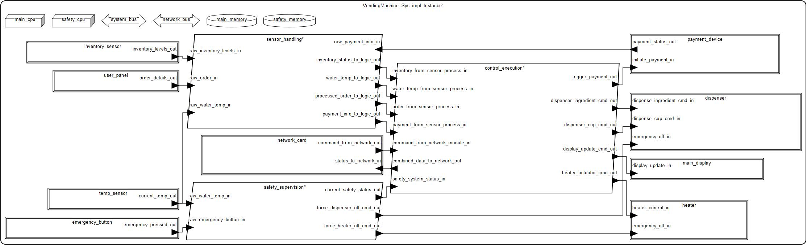

# Systemy czasu rzeczywistego - Model Automatu do Gorących Napojów w języku AADL

# Autor:
- Tomasz Madeja, tomaszmadeja@student.agh.edu.pl
- Karol Kowalczyk, bolek@student.agh.edu.pl

# Opis projektu

Projekt "Automat do Gorących Napojów" realizowany jest w języku AADL i ma na celu stworzenie modelu systemu sterowania dla maszyny vendingowej. System skupia się na podstawowych funkcjach czasu rzeczywistego, takich jak obsługa użytkownika, kontrola przygotowania napoju, monitorowanie stanu urządzenia oraz zapewnienie podstawowych mechanizmów bezpieczeństwa. Model został zaprojektowany z myślą o przejrzystości, demonstrując kluczowe aspekty modelowania systemów w AADL, w tym rozdzielenie odpowiedzialności na dedykowane jednostki przetwarzające.

# Funkcjonalności systemu:

- Wybór napoju przez użytkownika.
- Symulacja procesu płatności.
- Sterowanie dozowaniem składników i wydawaniem kubka.
- Kontrola procesu podgrzewania wody.
- Wyświetlanie podstawowych statusów i komunikatów dla użytkownika.
- Monitorowanie kluczowych parametrów (np. temperatura wody, uproszczony stan zapasów).
- Obsługa przycisku awaryjnego zatrzymania.
- Dedykowane monitorowanie krytycznych parametrów bezpieczeństwa (np. przegrzanie).
- Możliwość wysyłania zagregowanych informacji o stanie automatu oraz raportów o stanie zdrowia systemu przez sieć (uproszczona symulacja).

# Komponenty modelu:

### Pakiet
- `vending_machine` – główny pakiet grupujący wszystkie elementy modelu automatu.

### System
- `VendingMachine_Sys` – główny komponent systemowy, integrujący podsystemy automatu.

### Procesory
- `Control_Cpu` – procesor wykonujący główną logikę sterowania automatem oraz obsługę wejścia/wyjścia.
- `Safety_Cpu` – dedykowany procesor dla krytycznych funkcji bezpieczeństwa.

### Pamięci
- `Control_Mem` – pamięć operacyjna dla `Control_Cpu` i danych systemu.
- `Safety_Mem` – pamięć operacyjna dla `Safety_Cpu` i danych systemu bezpieczeństwa.

### Magistrale
- `System_Bus` – główna magistrala systemowa do komunikacji między kluczowymi komponentami.
- `Network_Bus` – magistrala do komunikacji z modułem sieciowym.

### Typy Danych (przykładowe, w kodzie bardziej szczegółowe)
- `BeverageOrderData`, `PaymentInfoData`, `WaterConditionData`, `InventoryStatusData`, `MachineDisplayData`, `ExternalCommandData`.
- `OutgoingNetworkData` – zagregowane dane wysyłane przez sieć.
- `Safety_Status_Data` – dane o stanie systemu bezpieczeństwa.

### Procesy
- `InputSensingProcess` (na `Control_Cpu`) – proces zbierający dane z sensorów i wejść użytkownika.
- `MainControlExecutionProcess` (na `Control_Cpu`) – proces wykonujący główną logikę sterowania i komunikację.
- `Safety_Supervision_Process` (na `Safety_Cpu`) – proces odpowiedzialny za monitorowanie bezpieczeństwa i reakcję na zagrożenia.

### Wątki (wybrane kluczowe)
- W `InputSensingProcess`:
    - `UserInputMonitorThread`, `PaymentStatusMonitorThread`, `WaterTemperatureMonitorThread`, `InventoryLevelMonitorThread`.
- W `MainControlExecutionProcess`:
    - `VendingControlLogicThread` – główny wątek koordynujący, zarządzający stanem automatu.
    - `NetworkCommandReceiverThread` – wątek odbierający komendy z sieci.
    - `System_Health_Monitor_Thread` – wątek zbierający informacje o stanie systemu, statusie operacyjnym i generujący zagregowane raporty do wysłania przez sieć.
- W `Safety_Supervision_Process`:
    - `Critical_Temperature_Monitor_Thread` – monitoruje temperaturę pod kątem niebezpiecznych wartości.
    - `Emergency_Stop_Handler_Thread` – obsługuje sygnał z przycisku awaryjnego.
    - `Safety_Coordinator_Thread` – koordynuje działania systemu bezpieczeństwa.

### Urządzenia
- `UserSelectionPanel` – panel użytkownika (przyciski, wyświetlacz).
- `PaymentTerminalDevice` – terminal płatniczy.
- `WaterTemperatureSensorDevice` – czujnik temperatury wody.
- `HeaterActuatorDevice` – grzałka (z możliwością awaryjnego wyłączenia).
- `DispensingMechanismDevice` – mechanizm dozujący (z możliwością awaryjnego wyłączenia).
- `InventorySensorDevice` – czujnik zapasów.
- `MachineDisplay` – wyświetlacz statusu.
- `NetworkInterfaceModule` – moduł interfejsu sieciowego.
- `EmergencyStopButtonDevice` – przycisk awaryjnego zatrzymania.

# Diagram Systemu

Poniżej przedstawiono diagram komponentów systemu automatu do gorących napojów.

# Analiza Wagowa

Analiza wagowa jest jednym z kluczowych aspektów analizy właściwości niefunkcjonalnych w AADL. Pozwala ona na weryfikację, czy suma wag poszczególnych komponentów systemu mieści się w zdefiniowanych limitach, co jest kluczowe w projektowaniu systemów o ograniczonych możliwościach nośnych lub przestrzennych. Poniżej przedstawiono wyniki analizy wagowej dla modelu automatu.

### Wagi poszczególnych komponentów:

| Komponent | Nazwa w modelu AADL | Waga (kg) |
| :--- | :--- | :--- |
| Magistrala systemowa | `system_bus` | 0,500 |
| Magistrala sieciowa | `network_bus` | 0,200 |
| Panel użytkownika | `user_panel` | 1,000 |
| Terminal płatniczy | `payment_device` | 0,800 |
| Czujnik temperatury | `temp_sensor` | 0,050 |
| Grzałka | `heater` | 2,500 |
| Mechanizm dozujący | `dispenser` | 5,000 |
| Czujnik zapasów | `inventory_sensor` | 0,200 |
| Wyświetlacz główny | `main_display` | 1,200 |
| Karta sieciowa | `network_card` | 0,150 |
| Przycisk awaryjny | `emergency_button` | 0,100 |
| Pamięć główna | `main_memory` | 0,100 |
| Pamięć systemu bezp. | `safety_memory` | 0,100 |
| Główny procesor | `main_cpu` | 0,200 |
| Procesor systemu bezp. | `safety_cpu` | 0,200 |

### Podsumowanie i weryfikacja limitów wagowych:

Suma wag jawnie zamodelowanych komponentów sprzętowych wynosi **12,300 kg**.

Narzędzie analityczne zgłosiło ostrzeżenie (`Warning! VendingMachine_Sys_impl_Instance: [G] Sum of weights (12,300 kg) less than gross weight of 55,000 kg`), informując, że suma wag komponentów jest niższa niż zadeklarowana waga brutto całego systemu (`Gross_Weight`). Różnica ta wynika z faktu, że waga brutto **55,000 kg** uwzględnia masę obudowy, wewnętrznej ramy, hydrauliki i innych elementów konstrukcyjnych, które nie zostały zamodelowane jako oddzielne komponenty z własną wagą. W dalszej analizie narzędzie poprawnie wykorzystuje zadeklarowaną wagę brutto.

Ostateczna analiza porównuje wagę brutto systemu z jego limitem wagowym (`Weight_Limit`):

- **Całkowita waga systemu (Gross Weight): 55,000 kg**
- **Maksymalny limit wagi (Weight Limit): 60,000 kg**
- **Rezerwa wagowa (Weight Slack): 8,3 %**

**Wniosek:** System **spełnia** założone wymagania wagowe, ponieważ jego całkowita masa (55,000 kg) nie przekracza zdefiniowanego limitu (60,000 kg), pozostawiając 8,3% rezerwy.

# Bibliografia:

1.  SAE International. *AS5506D: Architecture Analysis & Design Language (AADL)*. Kwiecień 2022. `https://www.sae.org/standards/content/as5506/`
2.  Feiler, P. H., Gluch, D. P., & Hudak, J. J. *Model-Based Engineering with AADL: An Introduction to the SAE Architecture Analysis & Design Language*. Addison-Wesley Professional, Wrzesień 2012. `https://www.amazon.com/Model-Based-Engineering-AADL-Introduction-Architecture/dp/0134208897`
3.  Software Engineering Institute, Carnegie Mellon University. *Architecture Analysis and Design Language (AADL)*. `https://insights.sei.cmu.edu/projects/architecture-analysis-and-design-language-aadl/`
4.  *EP1321908A2: Vending machine control system*. Zgłoszony 18 grudnia 2002. `https://patents.google.com/patent/EP1321908A2/en`